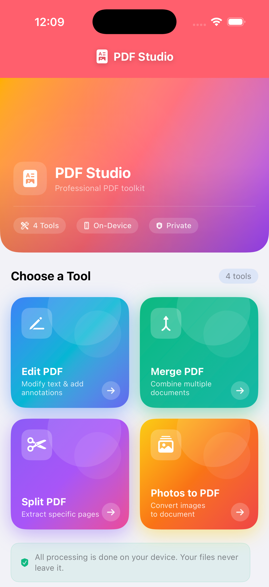
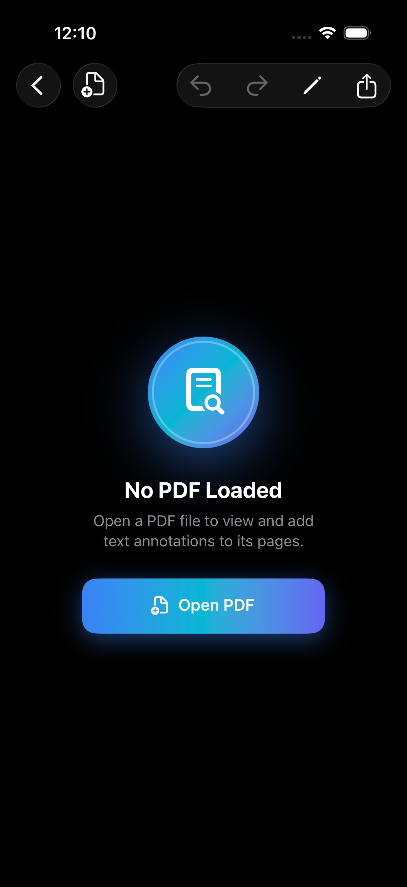
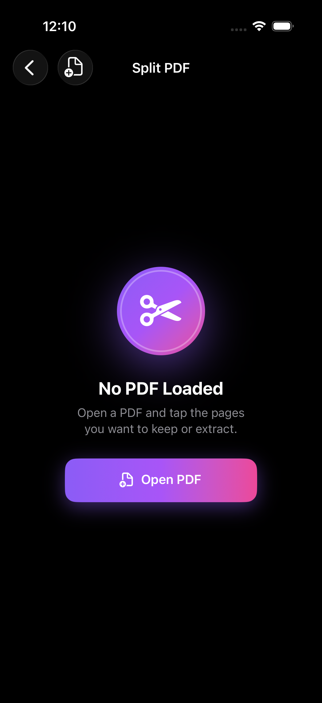

<div align="center">

# PDF Studio — Free PDF Toolkit

**A powerful, privacy-first PDF toolkit built natively for iPhone, iPad, and Mac.**

[](https://developer.apple.com)
[](https://swift.org)
[](https://developer.apple.com/xcode/swiftui)
[](LICENSE)

</div>

---

## Overview

**Free PDF Studio** is a native SwiftUI application that gives users a complete PDF toolkit entirely on-device — no subscriptions, no cloud uploads, no privacy trade-offs. It supports four core PDF workflows, wrapped in a premium dark-mode design system that adapts seamlessly across iPhone, iPad, and Mac.

---

## Screenshots

<div align="center">
<table>
  <tr>
    <td align="center">
      
      <br/><sub><b>Home</b></sub>
    </td>
    <td align="center">
      
      <br/><sub><b>Edit PDF</b></sub>
    </td>
    <td align="center">
      
      <br/><sub><b>Split PDF</b></sub>
    </td>
  </tr>
</table>
</div>

---

## Features

| Tool | Description |
|------|-------------|
| **Edit PDF** | Open any PDF and add text annotations at precise positions. Undo/redo support. Export the annotated document instantly. |
| **Merge PDF** | Import multiple PDFs, reorder them via drag-and-drop, and combine them into a single document. |
| **Split PDF** | Browse page thumbnails, select individual pages, and export a subset as a new PDF. |
| **Photos to PDF** | Pick images from your photo library, reorder them, and convert the set into a shareable PDF document. |

**Privacy First** — All processing happens locally on your device. Files are never uploaded to any server.

---

## Requirements

| Requirement | Version |
|-------------|---------|
| iOS | 26.5+ |
| macOS | 26.4+ |
| visionOS | 2+ |
| Xcode | 26+ |
| Swift | 6.0 |

---

## Architecture

The project follows an **MVVM** pattern with SwiftUI's `@Observable` macro and Swift 6 strict concurrency.

```
Free PDF Studio/
├── Theme/
│   └── AppTheme.swift          # Design tokens, color palette, gradient mesh, reusable modifiers
├── Models/
│   └── AppModels.swift         # PDFItem, TextAnnotationData, PDFTool
├── Utilities/
│   └── PDFProcessor.swift      # Core PDF engine — merge, split, annotate, images→PDF (nonisolated)
├── Components/
│   ├── PDFKitView.swift        # PDFKit UIViewRepresentable with tap callback
│   ├── PageThumbnailView.swift # Page thumbnail strip + adaptive grid
│   └── ShareSheet.swift        # UIActivityViewController wrapper (iOS only)
├── ViewModels/
│   ├── EditPDFViewModel.swift
│   ├── MergePDFViewModel.swift
│   ├── SplitPDFViewModel.swift
│   └── PhotosToPDFViewModel.swift
└── Views/
    ├── HomeView.swift           # Hero gradient + adaptive tool card grid
    ├── EditPDFView.swift
    ├── MergePDFView.swift
    ├── SplitPDFView.swift
    └── PhotosToPDFView.swift
```

### Key design decisions

- **Swift 6 concurrency** — `SWIFT_DEFAULT_ACTOR_ISOLATION = MainActor`. Background PDF work runs in `Task.detached` calling `nonisolated` `PDFProcessor` methods.
- **`PBXFileSystemSynchronizedRootGroup`** — Any Swift file dropped in the source folder is auto-included; no `pbxproj` edits needed.
- **`@Observable`** instead of `ObservableObject` — leaner view invalidation across all four ViewModels.
- **Adaptive grid layout** — `GridItem(.adaptive(minimum: 155))` on the home screen scales from 2 columns on iPhone to 3+ on iPad and Mac without any conditional code.

---

## Design System

The app uses a custom design system (`AppTheme.swift`) built for dark-mode-first, premium aesthetics:

- **Gradient mesh backgrounds** — each section has a named palette in `SectionPalette` (`home`, `edit`, `merge`, `split`, `photos`)
- **Adaptive semantic colors** — `Color.appBg`, `Color.cardWhite`, `Color.labelPrimary`, etc. adapt automatically between light and dark mode
- **Spring animations** — `.spring(response: 0.3)` on all empty↔content transitions
- **Tool cards** — full gradient fill with decorative circles, icon box, and arrow badge

---

## Getting Started

1. **Clone the repo**
   ```bash
   git clone https://github.com/codedbyaman/Free-PDF-Studio-iOS-.git
   cd Free-PDF-Studio-iOS-
   ```

2. **Open in Xcode**
   ```bash
   open "Free PDF Studio/Free PDF Studio.xcodeproj"
   ```

3. **Select a simulator or device** — any iPhone/iPad running iOS 26+, or a Mac running macOS 26+.

4. **Build & Run** — `⌘R`

No third-party dependencies. The project compiles entirely with Apple's built-in frameworks: **SwiftUI**, **PDFKit**, **PhotosUI**, **UniformTypeIdentifiers**.

---

## Contributing

Pull requests are welcome. For major changes, please open an issue first to discuss what you would like to change.

1. Fork the repository
2. Create your feature branch (`git checkout -b feature/my-feature`)
3. Commit your changes (`git commit -m 'Add my feature'`)
4. Push to the branch (`git push origin feature/my-feature`)
5. Open a Pull Request

---

## License

Distributed under the MIT License. See [`LICENSE`](LICENSE) for details.

---

<div align="center">
  <sub>Built with SwiftUI by <a href="https://github.com/codedbyaman">Aman-kumar</a></sub>
</div>
